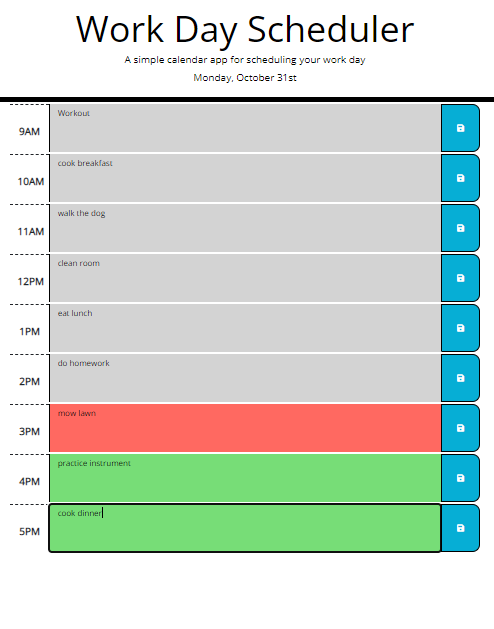

# Work Day Scheduler


## Description

Added ode that allowed for a daily schedule to have tasks added and saved into local storage for future reference. If the save button is not pressed the text input would not be saved. Also the text sections will change color depending on the time, going from green if that section is in the future, to red if that section is the current hour of the day, to grey if the hour is in the past.

## Motivation

I wanted to use API's such as Bootstrap and Moment.js to build the code and implement features provided withing the API's to meet the acceptance criteria of the project.

## Comments

I have added comments to more easily understand what each block of code is doing, I also have code that is not currently being used or is commented out of which I was trying to add different features and buttons. I was going to have the extra features turn on and off with the push of a button in the header, but rand out of time. I will try to seperate the origional project code and created a separate branch for the extras code I was working on.

## Screenshot



## Acceptance Criteria

```md
GIVEN I am using a daily planner to create a schedule
WHEN I open the planner
THEN the current day is displayed at the top of the calendar
WHEN I scroll down
THEN I am presented with timeblocks for standard business hours
WHEN I view the timeblocks for that day
THEN each timeblock is color coded to indicate whether it is in the past, present, or future
WHEN I click into a timeblock
THEN I can enter an event
WHEN I click the save button for that timeblock
THEN the text for that event is saved in local storage
WHEN I refresh the page
THEN the saved events persist
```

## Built Using

JavaScript
Bootstrap
Moment.js
jquery
fontawesome

## Credits

N/A

## License

Please refer to the LISCENSE in the repo